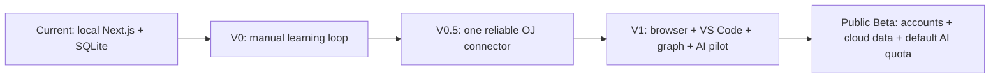
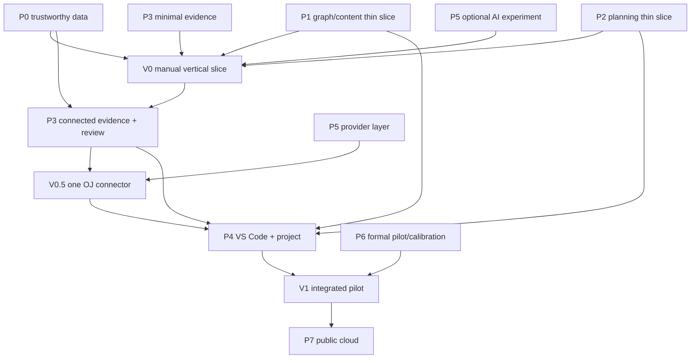

# AI Coding Growth Platform Product Development Roadmap

> **Status (2026-07-18):** **V0 exit candidate; F1-F4 final verification and user acceptance pending.** Engineering gates PASS at implementationSha `d6c0f14aafb663c8746ad5e30d968508d539ec07`; observationRecordSha `5a0e0a0f12a0fcf24683564fb5146087a9c59c9f`. See `work/reports/v0-exit-report.md` for the full SHA chain, decision and limitations. V0 is not declared complete or accepted until F1-F4 all APPROVE and the user explicitly accepts the V0 verification.

> **For agentic workers:** Before implementing a work package, use `superpowers:writing-plans` to expand it against the then-current codebase. During implementation use the appropriate execution skill, and use `superpowers:verification-before-completion` before declaring a release gate complete.

**Goal:** Turn the current local verdict-capture prototype into a learning-navigation and code-growth product that can first serve the owner and roommates, then evolve into a public cloud service.

**Primary user:** A first-year computer-science student who knows basic C++ but cannot yet solve simple OJ tasks consistently or build complete projects, uses Windows in a mainland-China network environment, and wants one credible next action instead of another large content catalog.

**Planning rule:** Product releases are vertical user experiences; engineering Phases are capability workstreams. Do not finish every Phase as a waterfall before testing the first usable release.

## 1. Document Authority

- `IDEA.md` owns product definition, adopted decisions, experiments and non-goals.
- This roadmap owns release slices, Phase ordering, dependencies and exit gates.
- Linked `phase-*.md` files own deliverables and phase-level verification.
- An atomic implementation plan is written only when a work package becomes active.
- `README.md`, `docs/architecture.md`, `docs/runbook.md` and `COMPLIANCE.md` describe the **currently implemented** system, not future claims.

Older 2026-07-05/06 plans use historical Phase numbers. They are implementation history, not the active product roadmap.

## 2. Current Baseline

The repository is **Pre-V0**, not a completed multi-platform learning system.

Available today:

- metadata-only problem links and source registry;
- a local Next.js + SQLite app;
- an MV3 extension that detects broad problem-page and visible verdict signals;
- isolated Playwright databases and reusable migrations;
- V2 session/submission identity, SPA lifecycle handling, serialized queue delivery, and localhost pairing credentials;
- raw capture events plus same-transaction projections, scoped attempt queries, canonical URLs, full Growth aggregates, and explicit Coach windows;
- manual attempts, visible source labels, optimistic correction history, and logical voiding;
- unit tests, Playwright smoke tests, extension builds, and production builds.

Not yet trustworthy or present:

- code snapshots;
- learner profile, graph, plans, evidence levels, review or projects;
- VS Code integration, real AI provider, accounts or cloud storage.

Phase 0 is therefore mandatory. No later capability may treat current verdict counts as a reliable learner model.

## 3. Product Invariants

1. One primary task is the default; alternatives are limited and secondary.
2. The knowledge map explains direction but always leads to an action.
3. Problem count and a single AC do not equal mastery.
4. Users choose a 15/30/60/90-minute effort boundary; the product does not shame them with predicted-time comparisons.
5. The public graph is versioned and authoritative; users and AI change personal routes, not public knowledge facts.
6. Rules, graph navigation, planning and basic analysis continue to work without AI.
7. AI explains and proposes; validated evidence and deterministic rules remain authoritative.
8. Commercial OJ content remains on the original platform; the product stores metadata, mappings and user-generated training records.
9. Code capture is limited to explicit training events and a selected workspace; no cookies, tokens, hidden tests or keystroke logging.
10. Every state change is auditable and cites evidence/reason versions.
11. Tests never open or mutate the default `training-platform.sqlite`.
12. Public cloud features require tenant isolation, deletion/export, consent and retention design before activation.

## 4. Architecture Evolution



### Local pilot architecture

```text
Browser extension → localhost API → SQLite → Today / Training / Coach / Growth
```

### Public target architecture

```text
Browser extension ┐
                  ├→ authenticated HTTPS API → tenant-scoped database/object storage
VS Code extension ┘                            → graph/rules/evidence → AI provider layer
```

The target is cloud SaaS, but the migration happens after the learning loop and capture hypotheses are demonstrated. Public storage must use a durable multi-tenant database and object storage; a shared SQLite file or ephemeral deployment filesystem is not a production design.

## 5. Release Gates

### Pre-V0 — Trustworthy technical foundation

User outcome: the current local tool stops corrupting or misclassifying its own evidence.

Includes:

- complete Phase 0A–0D;
- manual training-record fallback;
- install-scoped localhost credential and provenance;
- one candidate OJ fixture suite; other platforms labelled experimental;
- accurate current-state documentation.

Exit gate:

- fresh tests never touch the real database;
- one training session can contain multiple same/different verdict submissions without loss or false deduplication;
- SPA/pagehide/queue replay behavior is deterministic;
- per-problem attempts and Growth totals are correct;
- the full quality gate passes.

### V0 — Manual-first usable learning loop

User outcome: without relying on automation, a learner can understand a small route, receive one task, record the result and see the next decision change.

Thin slices drawn from Phases 1, 2, 3 and 5:

- 12–18 published capability nodes, 20–40 reviewed resource/problem links and the coarse common-foundation route;
- nine career directions as read-only summaries, not complete curricula;
- goal optionality, short diagnosis and user-adjustable starting point;
- `/map`, `/today`, `/plan` and manual training capture;
- 15/30/60/90-minute effort boundary;
- one primary task plus at most three semantic alternatives;
- minimal `unassessed + L1–L5` storage and explainable state changes;
- deterministic Coach plus one small, optional AI reflection experiment;
- one week of self-use and two weeks with 1–2 roommates.

Exit gate:

- a new user can reach and start a primary task without AI or a browser extension;
- every published node has provenance, outcome, resource and practice mapping;
- manual completion updates one node with a visible reason and uncertainty;
- at least two users complete the loop for two weeks and report whether the default task reduced choice friction;
- observed failures are recorded before scope expands.

### V0.5 — One connected OJ and basic evidence

User outcome: one supported OJ can automatically return a reliable submission timeline and code evidence to the learning plan.

Includes:

- freeze one production connector after a real-page feasibility probe; current default candidate is Luogu;
- session/submission identity, language, code snapshot, verdict and visible error/result capture;
- manual fallback for every missing field or adapter failure;
- full/basic/minimal capture modes and deletion controls;
- code diff and the five training outcomes: independent completion, assisted completion, productive struggle, unproductive trial-and-error, insufficient evidence;
- primary/supporting knowledge-node evidence;
- provider-neutral AI adapter, BYOK and a tightly limited platform-funded test quota;
- 2–5 people using the connector for 2–4 weeks.

Exit gate:

- at least 95% of deliberately generated supported-platform submissions in the fixture/manual test set are linked to the correct session; false attribution is zero in that set;
- replay cannot duplicate submissions or state transitions;
- users can inspect and correct/delete captured events and snapshots;
- AI-disabled behavior is unchanged; AI claims cite valid evidence IDs;
- capture success, correction rate and recommendation trust are measured.

The 95% figure is an engineering release target, not a claim about every future platform page.

### V1 — Integrated learning-navigation pilot

User outcome: the product connects career navigation, daily learning, OJ practice, local engineering work, review and one stage project.

Includes:

- layered interactive graph with accessible list fallback;
- all nine career summaries plus a deeper common-foundation route;
- five daily modes: learn, review, practice, build and recover;
- bounded quick replacement and reviewable AI plan proposals;
- VS Code extension and selected training workspace;
- local run/test/debug snapshots merged with browser OJ submissions;
- Git milestone references, not save-by-save commits;
- confidence decay, delayed verification, variant/transfer evidence and one C++ stage project;
- code/data view, export, deletion and retention controls;
- formal 5–10-person four-week pilot.

Exit gate:

- at least four pilot participants complete the four-week observation;
- zero unrecoverable data loss;
- each completing participant can back up/restore and inspect their evidence;
- the composite learning-loop signal in `IDEA.md` is measured, including task starts, plan completion and at least one verifiable node change;
- users can explain why at least one recommendation or level change occurred;
- the product records false mastery, wheel-spinning and over-practice cases instead of hiding them.

### Public Beta — Hosted SaaS

User outcome: a learner can use the product without running a local server, receive a limited default AI service and keep data across devices.

Includes Phase 7:

- account lifecycle and tenant-scoped authorization;
- durable relational database and encrypted object storage;
- authenticated browser/VS Code event ingestion, offline queue and conflict handling;
- platform default AI quota, abuse protection, provider fallback and cost controls;
- BYOK with encrypted secret storage; no per-user `.env.local` workflow;
- consent, provider disclosure, retention, export and deletion workflows;
- Chrome/Edge distribution and Windows install diagnostics;
- pricing experiment only after usage and provider cost are understood.

Exit gate:

- tenant isolation tests prove one user cannot read, mutate or infer another user's data;
- deletion removes account data and scheduled snapshot objects according to the published retention contract;
- all third-party AI transfers are attributable to a purpose and provider;
- quota/cost failure degrades to deterministic functionality;
- a documented incident, backup, restore and rollback path exists before public invitation.

## 6. Engineering Phase Portfolio

| Phase | Capability outcome | First release that consumes it | Status | Detailed plan |
|---|---|---|---|---|
| 0 | Capture and analytics are safe, attributable and reproducible | Pre-V0 | Complete — 2026-07-17; AtCoder sole production adapter | [Phase 0](./2026-07-11-phase-0-reliability-baseline.md) |
| 1 | Versioned common-foundation graph, career summaries and reviewed resources | V0 | Planned | [Phase 1](./2026-07-11-phase-1-curriculum-resource-catalog.md) |
| 2 | Goal, diagnosis, bounded daily planning and replanning | V0 | Planned | [Phase 2](./2026-07-11-phase-2-goals-diagnosis-planning.md) |
| 3 | Auditable evidence, five-level ability projection and review | V0 thin slice; V0.5 deepens | Planned | [Phase 3](./2026-07-11-phase-3-evidence-mastery-review.md) |
| 4 | VS Code workspace, local runs/tests and stage projects | V1 | Planned | [Phase 4](./2026-07-11-phase-4-practice-projects.md) |
| 5 | Provider-neutral default/BYOK AI coach with evidence citations | V0 experiment; V0.5/V1 deepen | Planned | [Phase 5](./2026-07-11-phase-5-byok-ai-coach.md) |
| 6 | Windows pilot, backup/restore and heuristic calibration | Begins in V0; formal at V1 | Planned | [Phase 6](./2026-07-11-phase-6-pilot-calibration.md) |
| 7 | Accounts, cloud storage, hosted quota and public operations | Public Beta | Later, explicit gate | [Phase 7](./2026-07-13-phase-7-public-beta-cloud.md) |

## 7. Dependency and Delivery Map



Content research may run in parallel with Phase 0, but imports and personalized decisions wait for the Phase 0 data-safety gate. Lightweight user observation begins in V0; Phase 6 is not the first contact with users.

## 8. Near-Term Execution Order

1. Phase 0 is complete (2026-07-17): AtCoder is the sole certified production adapter. Luogu production-adapter certification was attempted in Phase 0B4 and remains historically BLOCKED on missing public verdict DOM; it no longer blocks Phase 0 closure. Do not re-execute completed Phase 0 plans.
2. Phase 0D engineering gates (lint, CI parity, migration matrix, extension parity, final documentation) are already executed and verified; do not re-execute them.
3. Write one V0 vertical-slice design and atomic implementation plan spanning only the required Phase 1/2/3/5 tasks.
4. Publish the first 12–18 nodes and manual task flow; do not wait for an encyclopedia.
5. Run one week of self-use, fix blocking friction, then run a two-week roommate trial.
6. Only after the V0 report, freeze the V0.5 OJ adapter and code-snapshot contract.

## 9. Common Delivery Loop

Every active work package follows this sequence:

1. State the user-visible outcome and exact failure condition.
2. Write/update domain contracts and failing pure tests.
3. Implement the smallest service behavior.
4. Add repository/migration behavior using temporary databases.
5. Add API/UI or extension behavior after the service contract is stable.
6. Add one user-visible Playwright path and adapter fixtures where relevant.
7. Update current-state architecture, runbook, compliance and product-decision docs.
8. Run the complete gate and inspect the diff.
9. Put the slice in front of the owner or a roommate before expanding scope.

## 10. Technical Boundaries

- Current stack remains Next.js App Router, strict TypeScript, SQLite/`better-sqlite3`, Zod, MV3, Vitest and Playwright until the public-cloud design is activated.
- Domain schemas define facts; repositories own persistence; pure services own graph, planning, evidence, review and analysis.
- Content packages and personal learning data use stable independent versions.
- New migrations pass fresh-database and upgrade tests.
- Local pages close database handles; client components remain narrow interaction/polling shells.
- Unit and E2E tests never call a real external model or OJ.
- Browser platform adapters are isolated, fixture-tested and individually feature-flagged.
- Raw code is not placed in general analytics rows; snapshots use a dedicated store and retention policy.
- High-frequency training synchronization uses ordinary authenticated APIs, not MCP.
- Public multi-tenancy is designed before adding `user_id` mechanically to ad-hoc tables.

## 11. Quality Gate Commands

Run separately from the repository root:

```powershell
npm run lint
npm run db:migrate
npm run test
npm run typecheck
npm run e2e
npm run extension:check
npm run build
npm run quality:gate
```

`npm run quality:gate` runs the seven commands above in that exact order under an OS-temporary database and is the safe single verification. The Pre-V0 exit gate requires this aggregate gate plus a certified production adapter; AtCoder satisfies that condition as of 2026-07-17. E2E must first prove it is using a disposable database; until then, do not run it against valuable local data.

## 12. Scope Control

- One deep common-foundation slice before complete career curricula.
- One production OJ connector before adding a second.
- Manual fallback before automation.
- One C++ stage project before a generic project system.
- Rule-based evidence before statistical knowledge tracing.
- Provider-neutral AI interface before model routing complexity.
- BYOK/default quota before billing; billing before neither learning validation nor cost data.
- No social feed, leaderboard, streak pressure, online IDE, self-hosted judge, calendar import, MCP or self-trained foundation model in V1.

## 13. Roadmap Success

The roadmap succeeds when a first-year learner can:

1. understand several career directions without being forced to choose immediately;
2. see a credible common-foundation path and current position;
3. select today's effort boundary and start one explainable task;
4. train on an original OJ or in VS Code with a reliable record;
5. see an evidence-grounded level and uncertainty rather than a decorative score;
6. receive review, bridge, project or recovery work instead of endless same-form questions;
7. use AI for explanation and plan negotiation without granting it authority over facts;
8. complete a four-week loop with inspectable, exportable and recoverable data;
9. later use the hosted product with tenant isolation and clear control over code and AI data.
